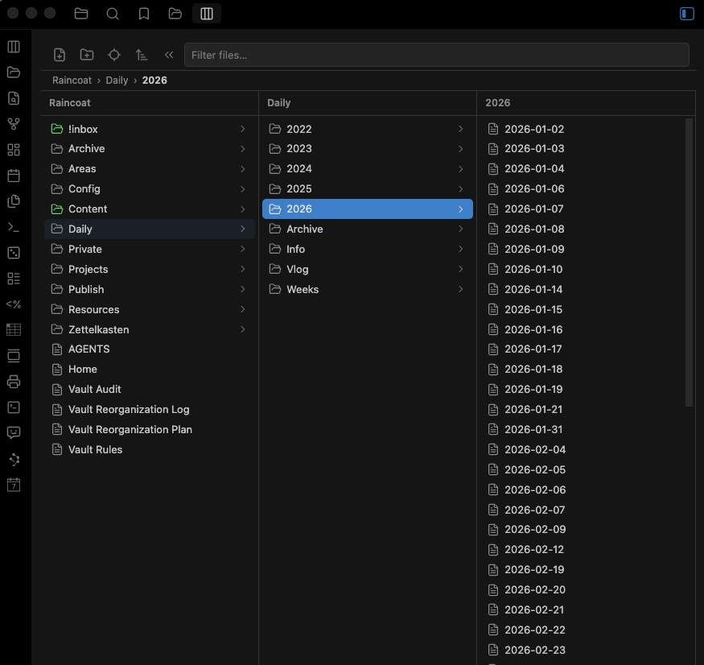
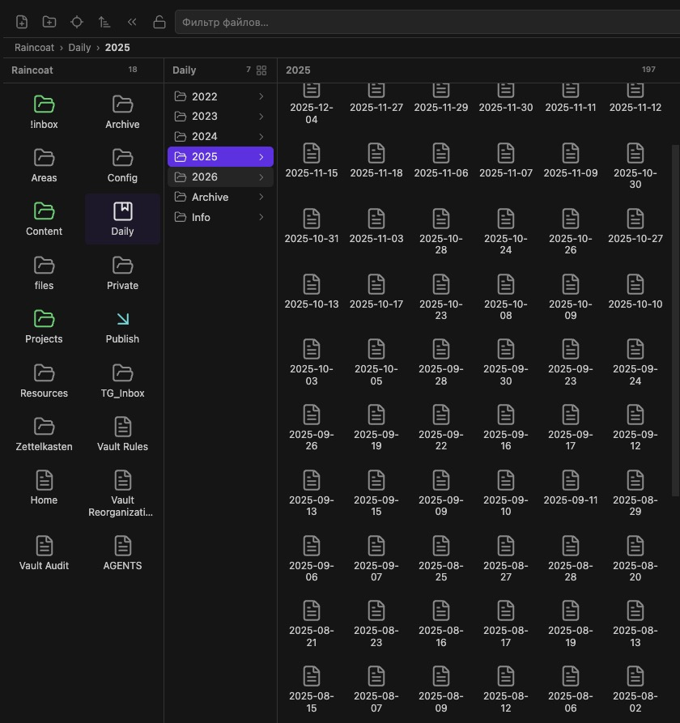

# Column Explorer

Browse your Obsidian vault in **Finder-style Miller columns** — click a folder and its contents open in a new column to the right. A full file manager: create, rename, move, drag & drop, multi-select, context menus, folder colors and more.



Every column can switch between a compact list and an icon grid — the choice is remembered per folder:



## Features

### Navigation
- **Miller columns** — drill down through folders, each level in its own column
- **Breadcrumbs** — clickable path bar for quick jumps to any ancestor folder
- **Folder notes** — optionally open the note named like its folder when selecting the folder
- **Keyboard navigation** — `↑`/`↓` select, `→`/`←` drill in/out, `Home`/`End`/`PageUp`/`PageDown`, type-ahead (start typing to jump, like in Finder), `Enter` open, `F2` rename, `Delete` trash
- **Filter** — live search box that filters files in every column
- **Auto-reveal** — optionally follow the active editor tab
- **Persistent state** — selected path survives app restarts

### Appearance
- **List or icon view per column** — toggle in the column header, remembered per folder
- **Image thumbnails** — the icon view shows real thumbnails for image files
- **Folder colors & icons** — right-click a folder: eight theme-aware color presets and any lucide icon
- **Pinned items** — right-click → *Pin to top*; drag one pin onto another to reorder
- **File preview column** — image, audio, video and PDF previews, note content, size, dates
- **Item counts** — each column header shows how many items it lists
- **Resizable columns** — drag the right edge of any column
- **Localized** — English and Russian UI

### File management
- **All standard operations** — create notes, canvases and folders (with inline rename), rename, trash, duplicate, move to folder, copy path
- **Multi-select** — `Ctrl`/`Cmd`-click to toggle, `Shift`-click for range; move, duplicate, delete or drag many at once
- **Drag & drop** — move files/folders between columns or straight onto a folder row; drag a file into an editor to insert a link
- **Full Obsidian context menu** — core & community plugin items (bookmarks, "Reveal in Finder", copy link, …) are injected via the `file-menu` event
- **Copy links** — copy a file's Markdown link or `obsidian://` URL from the context menu
- **Excluded files** — hide files and folders by patterns (`*.tmp`, `archive/`, `.trash`)
- **Sort options** — global default plus per-folder overrides (right-click a column header)

## Installation

### Manual

1. Download `main.js`, `manifest.json`, `styles.css` from the [latest release](https://github.com/N23eos/column_explorer/releases/latest)
2. Copy them into `<vault>/.obsidian/plugins/column-explorer/`
3. Enable the plugin in **Settings → Community plugins**

### Community plugins

Pending review for the community plugin directory.

## Usage

- Open via the **columns icon** in the ribbon, or the command *Open column explorer*
- *Reveal active file in columns* command (and toolbar button) jumps to the current note
- Right-click items for the context menu, right-click empty space to create a note, folder or canvas

## Development

```bash
npm install
npm run dev     # watch mode
npm run build   # typecheck + production build
npm test        # unit tests (vitest)
npm run lint    # eslint
```

The code lives in `src/`:

| Module | Responsibility |
|--------|----------------|
| `main.ts` | plugin entry, commands, view registration |
| `view.ts` | columns view: state, rendering orchestration, keyboard |
| `column.ts` | single column rendering with delegated events |
| `preview.ts` | file preview column |
| `dnd.ts` | drag & drop |
| `menus.ts` | context menus |
| `fileops.ts` | move/duplicate/trash operations |
| `modals.ts` | confirm & folder-picker modals |
| `settings.ts` | settings tab |
| `i18n.ts` | translations |
| `pure.ts` | pure helpers (unit-tested) |

### Releasing

```bash
npm version minor   # bumps package.json, manifest.json, versions.json
git push && git push --tags
```

The GitHub Action builds and attaches `main.js`, `manifest.json`, `styles.css` to the release.

## License

[MIT](LICENSE)

## Support

If this project was useful to you, feel free to support further development:

[](https://etherscan.io/address/0x77777da54702AC8789D53fc7cC6201C29a1A88C4)
[](https://etherscan.io/address/0x77777da54702AC8789D53fc7cC6201C29a1A88C4)
