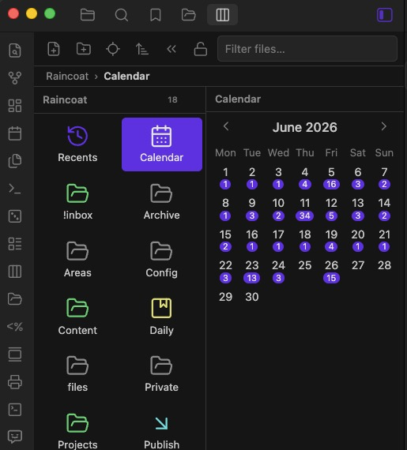

# Column Explorer

Browse your Obsidian vault in **Finder-style Miller columns** — click a folder and its contents open in a new column to the right. A full file manager: create, rename, move, drag & drop, multi-select, context menus, folder colors and more.





See the [changelog](CHANGELOG.md) for what changed in each release.

## Highlights

- **Miller columns** — Finder-style navigation, each folder opens a new column
- **Recents, Bookmarks & Calendar** — virtual rows in the first column: recently opened files (up to 50), your core-plugin bookmarks, and a month calendar with per-day created-note badges — click a day to list the notes created then
- **Import from the OS** — drop files from Finder/Explorer into any column to copy them into the vault
- **Folder colors, icons and pins** — eight theme-aware colors, any lucide icon, pin items to the top
- **List or icon grid per folder** — the grid shows real image thumbnails
- **Quick Look & preview column** — `Space` previews the selected file; optional details column with media previews
- **Resizable everything** — per-column widths, auto-resizing side panel, lockable column count
- **Full file manager** — multi-select, drag & drop with undo, context menus, per-folder sort, excluded files
- **Built for phones too** — one column at a time, a compact toolbar, long-press multi-select, edge-swipe navigation and an adjustable interface scale

## Features

### Navigation
- **Miller columns** — drill down through folders, each level in its own column
- **Breadcrumbs** — clickable path bar for quick jumps to any ancestor folder
- **Folder notes** — optionally open the note named like its folder when selecting the folder
- **Keyboard navigation** — `↑`/`↓` select, `→`/`←` drill in/out, `Home`/`End`/`PageUp`/`PageDown`, type-ahead (start typing to jump, like in Finder), `Enter` open, `Space` Quick Look, `F2` rename, `Delete` trash, `Ctrl`/`Cmd`+`A` select all in the column, `Ctrl`/`Cmd`+`D` duplicate
- **Back & forward** — navigation history buttons in the breadcrumbs bar
- **Favorites** — star any file or folder (context menu, or the star button in the breadcrumbs bar); they sit atop the Bookmarks column
- **Filter** — live search box that filters files in every column
- **Auto-reveal** — optionally follow the active editor tab
- **Persistent state** — selected path survives app restarts

### Appearance
- **List or icon view per column** — toggle in the column header, remembered per folder
- **Image thumbnails** — the icon view shows real thumbnails for image files
- **Folder colors & icons** — right-click a folder: eight theme-aware color presets and any lucide icon
- **Pinned items** — right-click → *Pin to top*; drag one pin onto another to reorder
- **File preview column** — image, audio, video and PDF previews, note content, size, dates
- **Item counts** — each column header shows how many items it lists
- **Resizable columns** — drag the right edge of any column
- **Localized** — English, Chinese (Simplified), German, Japanese, Korean, Brazilian Portuguese, Spanish, French, Italian and Russian, following Obsidian's own language setting

### File management
- **All standard operations** — create notes, canvases and folders (with inline rename), rename, trash, duplicate, move to folder, copy path
- **Multi-select** — `Ctrl`/`Cmd`-click to toggle, `Shift`-click for range; move, duplicate, delete or drag many at once
- **Drag & drop** — move files/folders between columns or straight onto a folder row; drag a file into an editor to insert a link
- **Full Obsidian context menu** — core & community plugin items (bookmarks, "Reveal in Finder", copy link, …) are injected via the `file-menu` event
- **Copy links & paths** — vault path, absolute system path, wikilink, Markdown link or `obsidian://` URL, from the context menu
- **Excluded files** — hide files and folders by comma-separated patterns. `*.tmp` matches by file name at any depth; `.trash` matches any path containing it; a trailing slash (`archive/`) is a path prefix **from the vault root**, so nested folders need their full path (`Notes/archive/`)
- **Sort options** — global default plus per-folder overrides (right-click a column header): name, modified, created or size, both directions

### Mobile

The plugin works on Android and iOS, with a layout of its own — desktop behaviour is unchanged.

- **One column at a time** — the deepest folder fills the screen; an *up* arrow in the column header walks back out
- **Compact toolbar** — back, forward, search, create and a *more* menu (reveal, collapse, sort)
- **Long-press to select** — hold an item to enter selection mode, then tap to add more; a bottom bar moves, duplicates, deletes or opens the full menu
- **Edge swipe** — swipe in from the left or right edge to go back or forward
- **Quick Look instead of a preview column** — open *Preview* from a file's menu; it slides up as a sheet
- **Adjustable scale** — *Settings → Mobile interface*: interface scale (90–150%) and icon size (22–36px), applied live. Touch targets never drop below 44px
- **No drag & drop** — on touch screens it fights with scrolling; move files through selection mode instead

## Installation

### Manual

1. Download `main.js`, `manifest.json`, `styles.css` from the [latest release](https://github.com/n23eos/column_explorer/releases/latest)
2. Copy them into `<vault>/.obsidian/plugins/column-explorer/`
3. Enable the plugin in **Settings → Community plugins**

### Community plugins

Browse **Settings → Community plugins → Browse** and search for *Column Explorer*.

## Usage

- Open via the **columns icon** in the ribbon, or the command *Open column explorer*
- Right-click items for the context menu, right-click empty space to create a note, folder or canvas

Commands (all bindable to hotkeys):

| Command | What it does |
|---------|--------------|
| *Open column explorer* | opens (or reveals) the view |
| *Reveal active file in columns* | jumps to the note open in the editor |
| *New note in current folder* | creates a note in the deepest selected folder |
| *New folder in current folder* | same, for a folder |

## Development

```bash
npm install
npm run dev     # watch mode
npm run build   # typecheck + production build
npm test        # unit tests (vitest)
npm run lint    # eslint
```

The code lives in `src/`:

| Module | Responsibility |
|--------|----------------|
| `main.ts` | plugin entry, commands, view registration |
| `view.ts` | columns view: state, rendering orchestration, keyboard |
| `column.ts` | single column rendering with delegated events |
| `mobile.ts` | mobile-only layer: toolbar, long-press selection, edge swipe, scale |
| `preview.ts` | file preview column |
| `dnd.ts` | drag & drop |
| `menus.ts` | context menus |
| `fileops.ts` | move/duplicate/trash operations |
| `modals.ts` | confirm, Quick Look, folder- and icon-picker modals |
| `settings.ts` | settings tab |
| `i18n.ts` | locale lookup; the strings live in `src/locales/` |
| `pure.ts` | pure helpers (unit-tested) |

Feature work happens on `dev`; `main` only moves on a release.

### Translations

Each locale is one file in `src/locales/`, named with Obsidian's own language code. English is
the source of truth: the others are typed against it, so a missing key fails the build, and
`tests/i18n.test.ts` additionally checks for extra keys, empty strings and placeholders (`{n}`,
`{name}`) lost in translation — for every locale registered in `src/i18n.ts`, automatically.

**None of the translations except Russian were reviewed by a native speaker.** Corrections are
very welcome and are a one-file change: edit `src/locales/<code>.ts` and open a pull request.
To add a language, copy `src/locales/en.ts`, translate the values, and register it in
`src/i18n.ts` under its [Obsidian language code](https://github.com/obsidianmd/obsidian-translations#existing-languages).

Right-to-left languages (Arabic, Hebrew, Persian) are not offered yet: the layout is
left-to-right throughout — columns grow rightwards, breadcrumbs are separated by `›`, and the
mobile edge swipe maps the left edge to "back". That needs CSS work, not just strings.

Tests cover `pure.ts` and `utils.ts`. The npm `obsidian` package ships types only, so
`tests/__mocks__/obsidian.ts` provides the handful of runtime classes those modules need,
wired up through `resolve.alias` in `vitest.config.ts`.

### Releasing

Tags carry no `v` prefix, so the version is set explicitly rather than through `npm version`:

```bash
npm pkg set version=X.Y.Z
npm_package_version=X.Y.Z node version-bump.mjs   # manifest.json + versions.json
npm run build
git commit -am "chore: bump version to X.Y.Z"
git checkout main && git merge --no-ff dev
git tag X.Y.Z && git push origin main --tags
```

The GitHub Action lints, tests, builds, and attaches `main.js`, `manifest.json`, `styles.css`
to the release with a build attestation.

## License

[MIT](LICENSE)

## Support

If this project was useful to you, feel free to support further development:

[](https://etherscan.io/address/0x77777da54702AC8789D53fc7cC6201C29a1A88C4)
[](https://etherscan.io/address/0x77777da54702AC8789D53fc7cC6201C29a1A88C4)
